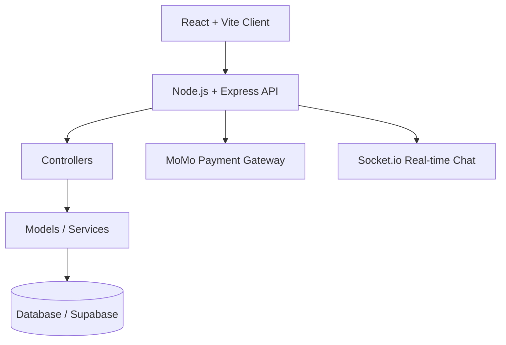

<div align="center">
  
  
  <br/>
  
  # 🏆 Sport-Ecommerce (Sports E-Commerce Platform)
  
  **Online sports shopping application with integrated automated payment, product management, and real-time support chat.**

[](https://nodejs.org/)
[](https://expressjs.com/)
[](https://reactjs.org/)
[](https://supabase.com/)
[](#)

</div>

---

## ✨ Features

- **Product, cart, and order management**
- **Online payment integration via MoMo Payment Gateway**
- **User authentication and Admin authorization**
- **Real-time live chat support via Socket.io**
- **Supabase service integration for database management**

## 🏗 Architecture



## 🛠 Tech Stack

| Layer     | Technology          |
| :-------- | :------------------ |
| Backend   | Node.js, Express.js |
| Frontend  | React.js, Vite      |
| Database  | MongoDB / Supabase  |
| Payment   | MoMo API            |
| Real-time | Socket.io           |

## 🚀 Getting Started

**Prerequisites:**

- **Node.js 16+**
- **npm or yarn**
- **Supabase & MoMo Accounts (to set up API keys)**

### Step 1: Clone the repository and set up environment

```bash
git clone https://github.com/ducpham211/Choose-your-own-accessories.git
cd Choose-your-own-accessories
```

### Step 2: Run Backend (Node.js / Express)

```bash
cd back-end
npm install
```

Create a `.env` file in the `back-end/` directory with the following variables:

```env
PORT=5000
JWT_SECRET=your_jwt_secret_key
SUPABASE_URL=https://<project>.supabase.co
SUPABASE_KEY=your_supabase_anon_key
MOMO_PARTNER_CODE=your_partner_code
MOMO_ACCESS_KEY=your_access_key
MOMO_SECRET_KEY=your_secret_key
MOMO_CALLBACK=your_callback_url
DATABASE_URL=your_database_url_or_mongo_uri
```

Start the backend server:

```bash
npm run dev
# Or npm start depending on the package.json setup
```

### Step 3: Run Frontend (React)

Open a new terminal, return to the root directory, and navigate to the `frond-end` folder:

```bash
cd frond-end
npm install
```

Configure Supabase directly in `frond-end/supabaseClient.js` or via environment variables.

Start the user interface:

```bash
npm run dev
# Open the browser at http://localhost:5173
```

## ⚙️ Environment Variables

| Variable            | Description                     |
| :------------------ | :------------------------------ |
| `PORT`              | Backend server port             |
| `JWT_SECRET`        | Secret key for JWT encryption   |
| `SUPABASE_URL`      | Supabase API URL                |
| `SUPABASE_KEY`      | Supabase API Key                |
| `MOMO_PARTNER_CODE` | MoMo Partner Code               |
| `MOMO_ACCESS_KEY`   | MoMo Access Key                 |
| `MOMO_SECRET_KEY`   | MoMo Secret Key                 |
| `DATABASE_URL`      | Database / Mongo Connection URL |

## 📂 Project Structure

The system is divided into two main directories within the same project:

### 1. Backend (`/back-end`)

```text
back-end/
├── config/         # System configurations (momo.js, supabase.js, etc.)
├── controller/     # Business logic and data flow for APIs
├── model/          # Schema/Database structure definitions
├── routes/         # API Endpoint definitions
└── server.js       # Main backend entry point file
```

### 2. Frontend (`/frond-end`)

```text
frond-end/
├── src/
│   ├── components/ # Shared UI Components (Buttons, Forms, etc.)
│   ├── context/    # Global State Management (React Context)
│   └── ...         # Other pages and components
└── supabaseClient.js # Supabase connection file from the frontend
```

## ✍️ Author

**Pham Viet Duc** - [GitHub](https://github.com/ducpham211)

- [LinkedIn](https://linkedin.com/in/viet-duc-pham)
